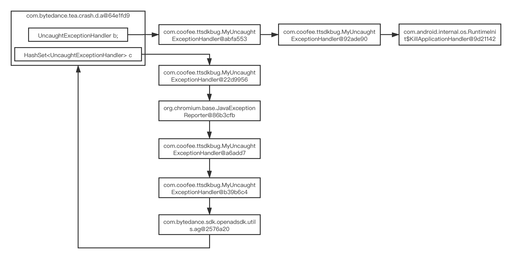

# 穿山甲sdk问题分析

## 穿山甲sdk 2.8.0.3版本不回调UncaughtExceptionHandler，导致无法统计崩溃信息，场景复现与分析

通过添加/删除如下代码启用/删除穿山甲sdk初始化代码，


编译安装app之后，当app运行时，在logcat中使用`MyUncaughtExceptionHandler`作为Tag关键字进行日志过滤。

* 在`App`中启用穿山甲sdk初始化代码，可以看到最后一条日志是`：MyUncaughtExceptionHandler: left 3 MyUncaughtExceptionHandler doest not invoke.`，详见下图：


* 在`App`中删除穿山甲sdk初始化代码，可以看到最后一条日志是`：MyUncaughtExceptionHandler: all of MyUncaughtExceptionHandler has invoked.`，详见下图：


综上，可以看到在`App`中共计添加了5个自定义的`MyUncaughtExceptionHandler`，当中初始化穿山甲sdk之后，有3个`MyUncaughtExceptionHandler`没有收到崩溃回调。


bug分析:

通过排查`Thread.UncaughtExceptionHandler`实现类，发现穿山甲sdk的`com.bytedance.tea.crash.d.a`类中的代码逻辑错误，导致自定义的`Thread.UncaughtExceptionHandler`未被回调，详细分析见下图

> 另：穿山甲sdk为了设置`Thread.setDefaultUncaughtExceptionHandler(this)`专门开了一条线程不定时的更新，暂不清楚这样做的意图？


## 穿山甲sdk 3.3.0.3版本`Thread.UncaughtExceptionHandler`循环引用分析

通过`UncaughtExceptionHandlerStats`类，定时获取在系统中注册的`Thread.UncaughtExceptionHandler`，打印日志如下：


从整体的日志可以看出，系统中注册的Thread.UncaughtExceptionHandler先后顺序和关联关系。下面我们主要分析倒数3条日志：

```
2020-12-16 15:13:55.872 5763-5763/com.coofee.ttsdkbug E/UncaughtExceptionHandlerStats: find circular reference=com.bytedance.tea.crash.d.a@64e1fd9, handlerSet=[com.android.internal.os.RuntimeInit$KillApplicationHandler@9d21142, org.chromium.base.JavaExceptionReporter@86b3cfb, com.coofee.ttsdkbug.MyUncaughtExceptionHandler@a6add7, com.bytedance.tea.crash.d.a@64e1fd9, com.bytedance.sdk.openadsdk.utils.ag@2576a20, com.coofee.ttsdkbug.MyUncaughtExceptionHandler@92ade90, com.coofee.ttsdkbug.MyUncaughtExceptionHandler@22d9956, com.coofee.ttsdkbug.MyUncaughtExceptionHandler@abfa553, com.coofee.ttsdkbug.MyUncaughtExceptionHandler@b39b6c4], just return.
2020-12-16 15:13:55.872 5763-5763/com.coofee.ttsdkbug E/UncaughtExceptionHandlerStats: dump end.
2020-12-16 15:13:55.873 5763-5763/com.coofee.ttsdkbug E/UncaughtExceptionHandlerStats: timer#1 root=Node{uncaughtExceptionHandler=com.bytedance.tea.crash.d.a@64e1fd9, children=[Node{uncaughtExceptionHandler=com.coofee.ttsdkbug.MyUncaughtExceptionHandler@abfa553, children=[Node{uncaughtExceptionHandler=com.coofee.ttsdkbug.MyUncaughtExceptionHandler@92ade90, children=[Node{uncaughtExceptionHandler=com.android.internal.os.RuntimeInit$KillApplicationHandler@9d21142, children=[]}]}]}, Node{uncaughtExceptionHandler=com.coofee.ttsdkbug.MyUncaughtExceptionHandler@22d9956, children=[Node{uncaughtExceptionHandler=org.chromium.base.JavaExceptionReporter@86b3cfb, children=[Node{uncaughtExceptionHandler=com.coofee.ttsdkbug.MyUncaughtExceptionHandler@a6add7, children=[Node{uncaughtExceptionHandler=com.coofee.ttsdkbug.MyUncaughtExceptionHandler@b39b6c4, children=[Node{uncaughtExceptionHandler=com.bytedance.sdk.openadsdk.utils.ag@2576a20, children=[Node{uncaughtExceptionHandler=com.bytedance.tea.crash.d.a@64e1fd9, children=[]}]}]}]}]}]}]}
```

从日志信息中我们可以知道`com.bytedance.tea.crash.d.a@64e1fd9`发生了循环引用，所以终止了统计避免。格式化最后一条日志，如下：

```
root=Node{
	uncaughtExceptionHandler=com.bytedance.tea.crash.d.a@64e1fd9,
	children=[
		Node{
			uncaughtExceptionHandler=com.coofee.ttsdkbug.MyUncaughtExceptionHandler@abfa553,
			children=[
				Node{
					uncaughtExceptionHandler=com.coofee.ttsdkbug.MyUncaughtExceptionHandler@92ade90,
					children=[
						Node{
							uncaughtExceptionHandler=com.android.internal.os.RuntimeInit$KillApplicationHandler@9d21142,
							children=[]
						}
					]
				}
			]
		},
		Node{
			uncaughtExceptionHandler=com.coofee.ttsdkbug.MyUncaughtExceptionHandler@22d9956,
			children=[
				Node{
					uncaughtExceptionHandler=org.chromium.base.JavaExceptionReporter@86b3cfb,
					children=[
						Node{
							uncaughtExceptionHandler=com.coofee.ttsdkbug.MyUncaughtExceptionHandler@a6add7,
							children=[
								Node{
									uncaughtExceptionHandler=com.coofee.ttsdkbug.MyUncaughtExceptionHandler@b39b6c4,
									children=[
										Node{
											uncaughtExceptionHandler=com.bytedance.sdk.openadsdk.utils.ag@2576a20,
											children=[
												Node{
													uncaughtExceptionHandler=com.bytedance.tea.crash.d.a@64e1fd9,
													children=[]
												}
											]
										}
									]
								}
							]
						}
					]
				}
			]
		}
	]
}
```

从数据上可以看出，`com.bytedance.tea.crash.d.a@64e1fd9`引用了`com.coofee.ttsdkbug.MyUncaughtExceptionHandler@22d9956`，而`com.coofee.ttsdkbug.MyUncaughtExceptionHandler@22d9956`最后又引用了`com.bytedance.tea.crash.d.a@64e1fd9`导致产生了循环引用。
将其转换为图，可以更直观的看出：



另外由于`Thread.UncaughtExceptionHandler`的实现类会一层层的向上回调，所以最终会抛出`StackOverflowError`。

那么为什么穿山甲sdk没有报错呢？

sdk在回调`Thread.UncaughtExceptionHandler`时捕获并忽略了所有的异常信息，所以从logcat看不到，详见下图：


